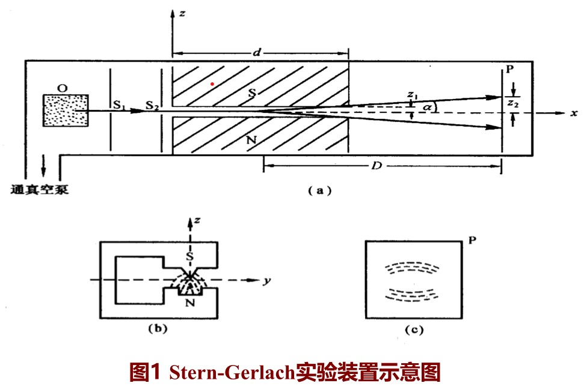

# 电子自旋的实验依据

## Stern-Gerlach实验

实验结果

* 没有磁场，银原子应准直到达Q点
* 加磁场，在底板上得到两条分开的条纹，位于准直位置Q的两边（偶数分裂）

理论分析

* 分裂是由于粒子磁矩与磁场相互作用引起的
  
  磁偶极矩在均匀外磁场中的势能

  $$
  U_B=-\vec{\mu}\cdot\vec{B}
  $$

  一个力可以写成势的负梯度，故一磁矩在z方向的受力可写成

  $$
  F_z=-\frac{\partial U_B}{\partial z}=\mu_x\frac{\partial B_x}{\partial z}+\mu_y\frac{\partial B_y}{\partial z}+\mu_z\frac{\partial B_z}{\partial z}
  $$

  在很小线度内非均匀磁场的作用下（设磁场及其梯度方向为z方向），有

  $$
  B_x=B_y=0 \\
  \frac{\partial B_z}{\partial x}=\frac{\partial B_z}{\partial y}=0
  $$

  受力方向仅在z方向，其大小为

  $$
  F_z=\mu_z\frac{\partial B_z}{\partial z}
  $$

  原子束沿水平（x方向）以速度v进入磁场区，在垂直方向（z方向）收到力$F_z$的作用。原子束在磁场区作平抛运动，运动方程为

  $$
  x=vt \\
  z_1=\frac{1}{2}\frac{F_z}{m}t^2
  $$

  原子束到达出口处与x轴的偏角为

  $$
  \alpha=\tg^{-1}(\frac{dz}{dx})_d=\tg^{-1}(\frac{2z_1}{x})=tg^{-1}(\frac{F_zt}{mv})=\tg^{-1}(\frac{F_zd}{mv^2})
  $$

  落在屏幕P处偏离x轴的距离为

  $$
  z_2=D\tg\alpha=\mu_z\frac{\partial B_z}{\partial z}\cdot\frac{dD}{3kT} \\
  \mu_z=\mu\cos\beta
  $$

  >一般实验条件（温度远低于$10^5K$）下，银原子处于基态，$z_2$不会出现分立

  * 轨道磁矩与轨道角动量相关

  $$
  \hat{\vec{\mu}}_l=-\frac{\mu_B}{\hbar}\hat{\vec{L}} \\
  \mu_z=-\mu_Bm
  $$

  其中

  $$
  \mu_B=e\hbar/2\mu c
  $$

结论

* 银原子在磁场中只有两个取向，有力证明了原子在磁场中的取向是量子化的

## 实验的深远意义

该实验是空间量子化的最直接的证明，也是第一次量度原子基态性质的实验，同时开辟了原子束及分子束实验的新领域

* 电子轨道运动产生磁矩。轨道角量子数为l的原子束经非均匀磁场后，由于磁矩的不同取向，将分离成(2l+1)个空间成分
* 基态银原子(Z=47)的角动量等于其价电子的角动量
* 半整数的角量子数
  
  如果角动量空间量子化理论是正确的，要得到偶数个$L_z$和$\mu_z$的值，唯一可能性是角量子数不是整数，而是半整数

  基态银原子束分离成两个空间成分，射线的偏转表明：电子除具有轨道角动量外还应具有自旋角动量（**角量子数S=1/2**）

## 说明

* 电子自旋的存在还为其它一系列实验所证实
  
  原子光谱的精细结构

  反常Zeeman效应

* 自旋是一种相对论量子效应，无经典对应。与空间运动无关，是粒子内部自由度。微观粒子内部自由度还有宇称、同位旋、色、味等

  在Dirac的相对论性电子方程中，这个内禀角动量很自然地体现在该方程的旋量结构上

* 自旋运动是微观粒子的重要特征，可以按照自旋状态对微观粒子进行分类（费米子和玻色子）

* 自旋是微观粒子的一种内禀运动，不能将自旋等同于宏观物体的“自转”。自旋角动量与电子的坐标和动量无关，是描写电子状态的第四个变量

* 新兴学科
  
  自旋电子学、自旋热电子学、半导体自旋电子学等
